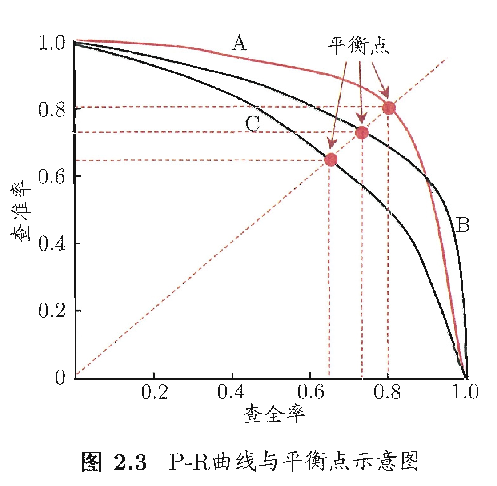
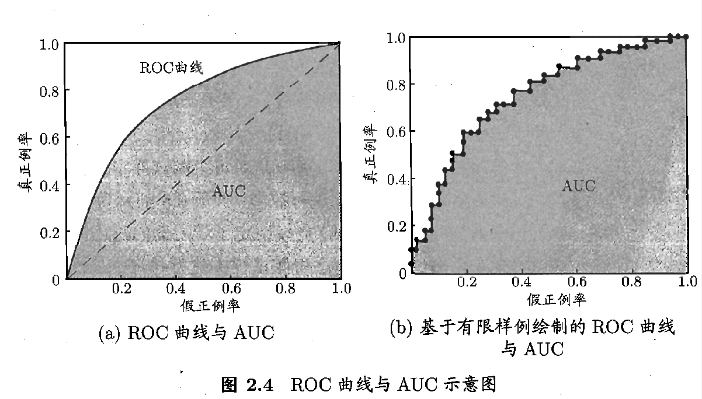
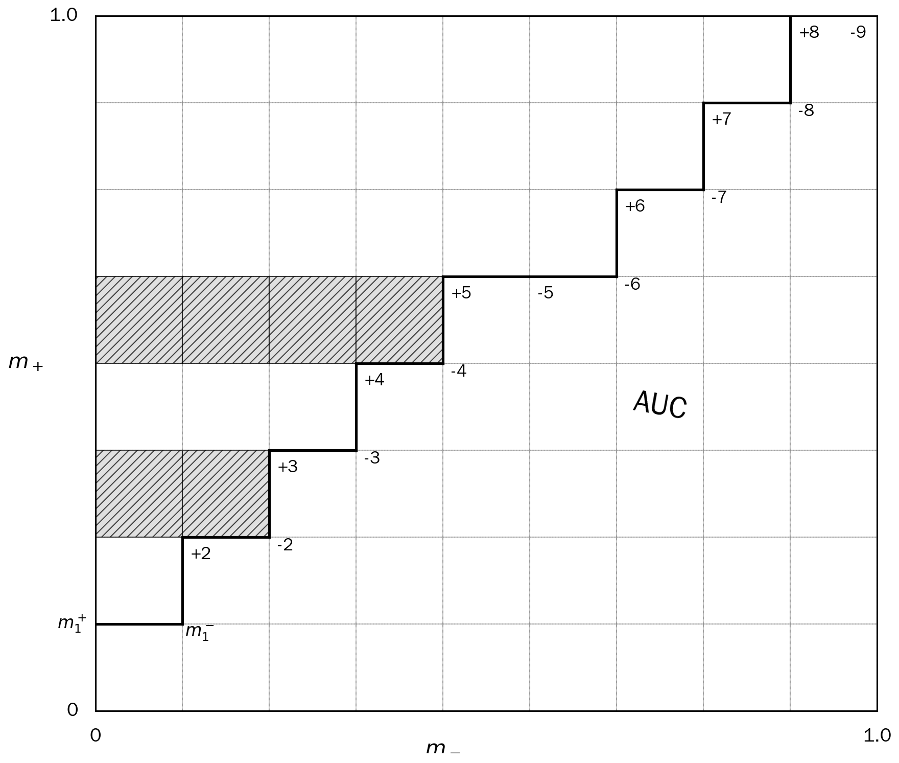

主要回顾《机器学习》周志华版各章节内容，内容动态更新...

<!--more-->

## 第一章 绪论

预测离散值 => 分类 classification

预测连续值 => 回归 regression

训练数据 有无标记？
- 有，监督学习 supervised learning（分类、回归）
- 无，无监督学习 unsupervised learning （聚类）

科学推理两大基本手段
- 归纳 induction （特殊到一般：泛化）
- 演绎 deduction （一般到特殊：特化）

假设选择原则
1. 奥卡姆剃刀：若有多个假设与观察一致，则选择最简单的那个
2. 多释原则：保留与经验观察一致的所有假设（集成学习）

---
## 第二章 模型评估与选择

**目标**：希望得到泛化误差小的学习器

**训练误差**，学习器在训练集上的误差 training error/empirical error

**泛化误差**，~在新样本上的误差 generalization error

**测试误差**，~在测试集上的误差，一般作为泛化误差的近似

### 2.2 评估方法

| 方法                          | 解释                                                                                                                                                                   |
| --------------------------- | -------------------------------------------------------------------------------------------------------------------------------------------------------------------- |
| 留出法 (hold-out)           | 训练/测试集的划分尽可能保持数据分布的一致性 从采样角度看，保留类别比例的采样称为“分层采样” 用法：n次随机划分，n个结果，最后取n个结果的平均                                                                                      |
| 交叉验证法 (cross validation) | 数据集D -> k个互斥大小相似的集合 每次选1个作为测试集，其他作为训练集，k次结果求平均 通常，做p次随机划分，k折，最后取p次k折结果的均值 **留一法**(leave-one-out)：k为样本数，则测试集每次只有1个样本，划分仅一种，即p=1                              |
| 自助法 (boost strapping)    | D ----随机采样m次----> D' （m=样本数=采样次数） $\lim_{m \to \infty} (1 - \frac{1}{m})^m \rightarrow \frac{1}{e} \approx 0.368$  即D中有36.8%的样本，不存在于D'中。 则D'可作训练集，D/D'作为测试集 |

目标，实际评估样本（训练集D'）与期望评估样本（总数量集、总样本集D）数量一致
“包外估计”（out-of-bag estimate）

自助法 \
**优点：** 数据集较小、难以有效划分训练/测试集时很有用 \
**缺点：** 产生的训练集改变了初始数据集的分布，会引入估计偏差 \
★在初始数据量足够时，留出法和交叉验证法更常用

**调参与最终模型**

>模型交付流程：训练数据仅占总样本的一部分，所以最后在得到最优模型（学习算法、参数配置）后，再使用全样本D训练该模型，然后交付模型
>
>P.S. 训练数据 = 训练集 + 验证集（validation set）\
>-----------------基于验证集上的性能，来进行模型选择和调参 \
>前文”交叉验证法“中的测试集属于这里的验证集 \
>测试集，用来估计模型在实际使用时的泛化能力（一般是独立的）

### 2.3 性能度量

评估学习器的泛化性能
- 有效可行的实验估计方法
- 衡量模型泛化能力的评价标准

样本集 $D={(x_1,y_1),(x_2,y_2)...(x_m,y_m)}$ \
学习器$f$ \
预测结果$f(x)$ 

| 任务类型 | 度量方法 |
| ---- | ---- |
| 回归任务 | 常用“均方误差”（mean squared error）     $E(f;D）=\frac{1}{m}\sum_{i=1}^{m}(f(x_i)-y_i)^2)$ 一般化数据分布$D$，概率密度函数$p(·)$，均方误差如下     $E(f;D)=\int_{x\sim{D}}(f(x)-y)^2p(x)dx$                                                                                                                                                                          |
| 分类任务 | 错误率  $E(f;D)=\frac{1}{m}\sum_{i=1}^{m}\mathbb{I}(f(x_i)\neq y_i)$ 精度  $acc(f;D)=\frac{1}{m}\sum_{i=1}^{m}\mathbb{I}(f(x_i) = y_i)$ 其中  $E(f;D)+acc(f;D)=1$ 一般化后，分布$D$，概率密度$p(·)$     $E(f;D) = \int_{x\sim{D}}\mathbb{I}(f(x) \neq y)p(x)dx$ 	$acc(f;D) =  \int_{x\sim{D}}\mathbb{I}(f(x) = y)p(x)dx = 1-E(f;D)$ 同样  $E+acc=1$ |

T: true  F: false  P: Positive  N: negative

| 真实情况 | 预测为正 | 预测为负 |
| ---- | ---- | ---- |
| 正例   | TP   | TN   |
| 反例   | FP   | FN   |
查准率  $P = \frac{TP}{TP+FP}$
查全率  $R = \frac{TP}{TP+FN}$

★对学习器的度量$F_1$是基于查准率与查全率的调和平均(harmonic mean)定义的：
$$
\frac{1}{F} = \frac{1}{2}·(\frac{1}{P}+\frac{1}{R})
$$
$F_\beta$则是加权调和平均
$$
F_\beta =\frac{1}{1+\beta^2}(\frac{1}{P}+\frac{\beta^2}{R})
$$
> P.S. 与算数平均（$\frac{P+R}{2}$）和几何平均（$\sqrt{R \times P}$）相比，调和平均更重视较小值

这里$\beta>0$，度量相对重要性
当 $\beta=1$ 时，$F_\beta$为标准$F_1$；当 $\beta>1$ 时，$R$影响大；当 $\beta<1$ 时，$P$影响大；

**多个二分类混淆矩阵的情况：**
- $n$ 次训练/测试 $\Rightarrow$ $n$ 个矩阵
- 多分类任务，每两两类组合 $\Rightarrow$ $n$ 个矩阵

**方法一（宏平均）：** 计算每个矩阵的 $(P_1, R_1), (P_2, R_2), ..., (P_n, R_n)$，再平均：

- 宏查准率：$macro\text{-}P = \frac{1}{n}\sum_{i=1}^{n}P_i$
- 宏查全率：$macro\text{-}R = \frac{1}{n}\sum_{i=1}^{n}R_i$
- 宏$F_1$：$macro\text{-}F_1 = \frac{2 \times macro\text{-}P \times macro\text{-}R}{macro\text{-}P + macro\text{-}R}$

**方法二（微平均）：** 对每个矩阵各元素平均 $\overline{TP}, \overline{FP}, \overline{TN}, \overline{FN}$

- 微查准率：$micro\text{-}P = \frac{\overline{TP}}{\overline{TP}+\overline{FP}}$
- 微查全率：$micro\text{-}R = \frac{\overline{TP}}{\overline{TP}+\overline{FN}}$
- 微$F_1$：$micro\text{-}F_1 = \frac{2 \times micro\text{-}P \times micro\text{-}R}{micro\text{-}P + micro\text{-}R}$

#### P-R图（P-R曲线）

- **Precision（查准率）**
- **Recall（查全率）**

图中A、B、C代表三个不同的学习器：
- A优于C，因A曲线包住了C曲线
- 若以"平衡点"（Break-Event Point）衡量，则A优于B
- 由于BEP过于简化，常用 $F_1$ 度量

#### ROC曲线（Receiver Operating Characteristic）

**定义：**
- **TPR（真正例率）** $= \frac{TP}{TP+FN}$
- **FPR（假正例率）** $= \frac{FP}{FP+TN}$

#### **学习器性能度量指标 — AUC（Area Under ROC Curve）** 
ROC曲线下的面积

**绘制ROC曲线步骤：**
1. 对于 $m^+$ 个正例，$m^-$ 个反例，根据学习器预测结果进行排序
2. 分类阈值设为最大，则所有样例均为反例，TPR、FPR均为0，则坐标 $(0,0)$
3. 分类阈值设为第 $i$ 个样本的预测值，设第$i-1$个样本的坐标为$(x,y)$，则：
   - $i$ 为真正例时，坐标 $(x, y+\frac{1}{m^+})$
   - $i$ 为假正例时，坐标 $(x+\frac{1}{m^-}, y)$
4. 重复步骤3，直到分类阈值降为0（或最后一个样本预测值）

**AUC计算公式（梯形法）：**
$$AUC = \frac{1}{2}\sum_{i=1}^{m-1}(x_{i+1}-x_i)\cdot(y_i+y_{i+1})$$

根据图计算面积。

给定 $m^+$ 个正例和 $m^-$ 个反例，令 $D^+$ 和 $D^-$ 分别表示正、反例集合，则"排序""损失"定义为：
$$
l_{rank} = \frac{1}{m^+m^-}\sum_{x^+\in D^+}\sum_{x^-\in D^-}\left(\mathbb{I}(f(x^+) < f(x^-))+\frac{1}{2}\mathbb{I}(f(x^+)=f(x^-))\right)
$$

**解释：** 考虑每一对正、反例，若正例的预测值小于反例，则记一个"罚分"；若相等则记0.5个"罚分"。

$l_{rank}$ 对应的是ROC曲线之上的面积，因此：
$$AUC = 1 - l_{rank}$$

> #ZC  **AUC面积思路：** 可将整个单位区域视为 $m^+ \times m^-$ 个格子。
> 
> 对于每个 $m^+$ 样本，$ \sum_{x^-\in D^-}(\mathbb{I}(f(x^+) < f(x^-))+\frac{1}{2}\mathbb{I}(f(x^+)=f(x^-))) $ 计算的是样本点对应坐标左侧的一行格子总数。
> 
> 对于正、反例预测值相同的情况，则所绘制的曲线可能是“先右后上”，也可能是“先上后右”，因为其排序可能会存在偶然性。体现在损失函数中，则计算"半个格子"的面积。
> 
> **结论：** 严格来说，上述AUC的直接计算公式受限于排序的偶然性，在正、反例有相同预测值的情况下，其结果具有偶然性。则使用 $AUC = 1 - l_{rank}$ 计算其值，更为合理。

## 第八章 集成学习

> #ZC  随机森林（Random Forest） VS   Bagging
> 
> 	1.花费下降。原因：相较于Bagging选取所有维度d作为划分属性（此过程开销较大），RF仅选取了k<d个维度作为划分属性（开销相对较小），根据经验推荐$k=log_2(d)$
> 	
> 	2.泛化性提高。原因：Bagging仅具备样本扰动，RF在样本扰动基础上，引入了属性扰动
> 

