本章主要介绍序列比对的基本概念、动态规划方法进行全局比对、全局比对和局部对比、考虑仿射空位的序列比对等。


<!--more-->


## 1 序列比对基础
（Sequence Alignment）

### 研究对象

- **B**iology
   - What is the biological question or problem?
- **D**ata
  - What is the input data?
  - What other supportive data can be used?
- **M**odel
  - How is the problem formulated computationally?
  - Or, what's the data model?
- **A**lgorithm
  - What is the computational algorithm?
  - How about its performance/limitation?


### 生物学问题

**"How can we determine the similarity between two sequences?"**

"我们如何确定两条序列之间的相似性？"

**Why is it important?**（相似性为什么重要？）

- Similar sequence → Similar structure → Similar function（相似序列 → 相似结构 → 相似功能）
    - The "**Sequence-to-Structure-to-Function Paradigm**"（"序列-结构-功能范式"）

- Similar sequence → Common ancestor（相似序列 → 共同祖先）
    - "**Homology**"，即"**同源性**"


### 生物学中的序列比对
（Sequence Alignment in Biology）

The purpose of a sequence alignment is to line up all residues in the inputted sequence(s) for **maximal level of similarity**, in the sense of **their functional or evolutionary relationship**.
（序列比对的目的是将输入序列中的所有残基排列起来，以达到**最大程度的相似性**，这种相似性是基于**它们的功能或进化关系**的。）


### 示例：序列比对实例与打分系统

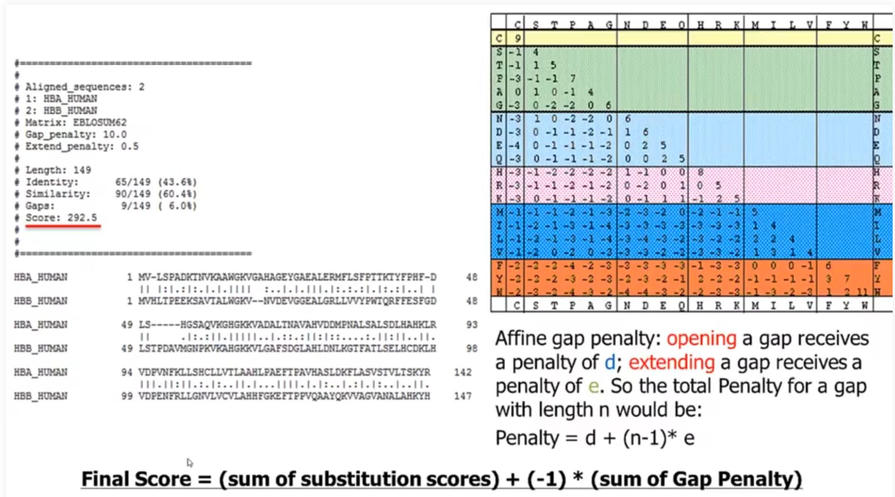

- 左侧：序列比对结果（HBA vs HBB 人类血红蛋白）
- 右上：BLOSUM62 替换矩阵
- 右下：仿射空位罚分（Affine gap penalty）

    **Affine gap penalty:** **opening** a gap receives a penalty of **d**; **extending** a gap receives a penalty of **e**. So the total Penalty for a gap with length n would be: 
    **Penalty = d + (n-1) * e**

- 底部：最终得分公式

    **Final Score = (sum of substitution scores) + (-1) * (sum of Gap Penalty)**
    
    最终得分 = 替换得分总和 + (-1) × 空位罚分总和）


## 2 动态规划方法进行全局比对

### Pairwise Sequence Alignment: in Maths

- **Input data:**
  - Two sequences S1 and S2

- **Parameter(s)**
  - A scoring function **f** for
    - Substitutions
    - Gaps

- **Output:**
  - The **optimal alignment** of S1 and S2, which has the **maximal score**.

Goal in math：
$$\arg\max_{ali}(f(ali(S1, S2)))$$


### Sequence Alignment: Enumerate? （能否穷举）

**示例（LSPADK vs LTPEEK）：**

```
| LSPADK | L-SPADK | L-SPADK |
| LTPEEK | LTPEEK- | LT-PEEK |

| ------LSPADK | L-S-P-A-D-K- |
| LTPEEK------ | -L-T-P-E-E-K |
```
**序列长度为n时，可能的比对次数：**

$$\binom{2n}{n} = \frac{(2n)!}{(n!)((2n-n)!)}$$

--- 

**残基比对的两种可能**

- A residue can either
    - Align to other residue, or
    - Align to a gap

**三种比对方式示意图：**
```
  S  |  S  |  -
  T  |  -  |  T
```
（匹配/错配、序列1插入空位、序列2插入空位）


**动态规划的核心思想**

New Best Alignment = Previous Best + Local Best

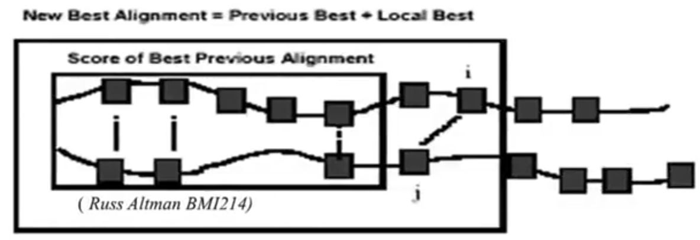

两条序列的残基逐步比对，通过方块和连线表示比对路径

### 动态规划公式 
Sequence alignment with Dynamic Programming

- Align two sequences: **x** and **y**
  - F(i,j) is the score of the best alignment between $x_{1...i}$ and $y_{1...j}$
  - s(A,B) is the score for substituting A with B; **d** is the (linear) gap penalty

**递推公式：**

$$F(0,0) = 0$$

$$F(i,j) = \max \begin{cases} F(i-1, j-1) + s(x_i, y_j) & \text{x}_i \text{ aligned to } \text{y}_j \\ F(i-1, j) + d & \text{x}_i \text{ aligned to a gap} \\ F(i, j-1) + d & \text{y}_j \text{ aligned to a gap} \end{cases}$$

---

### 示例：使用动态规划进行全局比对

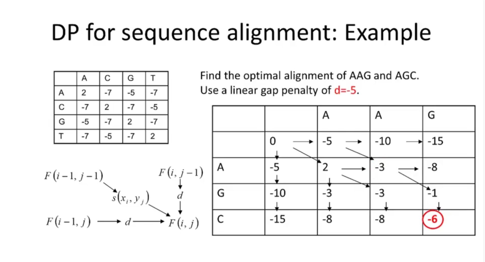

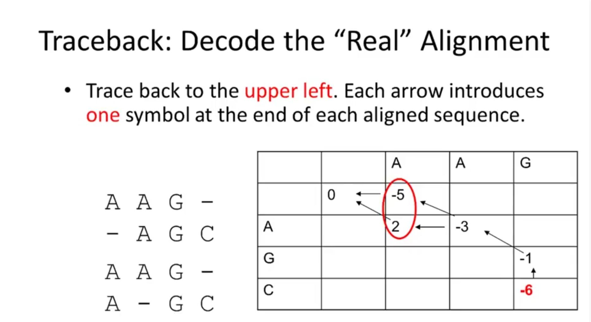


## 3 全局比对 VS 局部比对

- 全局比对（Global Alignment）
    - 算法：Needleman–Wunsch algorithm (1970)

- 局部比对（Local alignment）
    - 算法：Smith-Waterman algorithm (1981)

### 全局比对与局部比对的递推公式对比

#### 全局比对（Global alignment）

$$F(0,0) = 0$$

$$F(i,j) = \max \begin{cases} F(i-1, j-1) + s(x_i, y_j) \\ F(i-1, j) + d \\ F(i, j-1) + d \end{cases}$$

---

#### 局部比对（Local alignment）

$$F(0,0) = 0$$

$$F(i,j) = \max \begin{cases} F(i-1, j-1) + s(x_i, y_j) \\ F(i-1, j) + d \\ F(i, j-1) + d \\ \boxed{0} \end{cases}$$

（注：局部比对比全局比对多了一个取 **0** 的选项）

---

### 示例：局部比对的动态规划

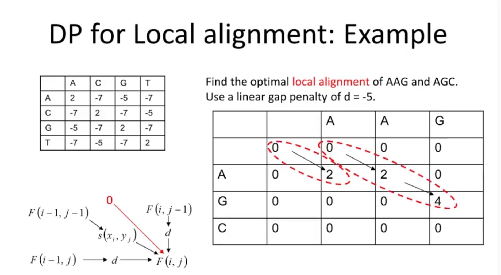

#### 全局比对 vs 局部比对（Global vs. Local）

---

##### 全局比对公式（上方）

$$F(0,0) = 0$$

$$F(i,j) = \max \begin{cases} F(i-1, j-1) + s(x_i, y_j) \\ F(i-1, j) + d \\ F(i, j-1) + d \end{cases}$$

**全局比对结果示例：**
```
 AAG-    AAG-
 -AGC    A-GC

```

---

##### 局部比对公式（下方）

$$F(0,0) = 0$$

$$F(i,j) = \max \begin{cases} F(i-1, j-1) + s(x_i, y_j) \\ F(i-1, j) + d \\ F(i, j-1) + d \\ 0 \end{cases}$$

**局部比对结果示例：**
```
 AG     A
 AG     A
```


## 4 考虑仿射空位罚分的序列比对

前面例子均未考虑gap opening和gap extending罚分不同的情形，本节借助**状态机模型**来讨论此情况。

### 状态定义表

| 状态 | 含义 |
|------|------|
| **M** | **Match** (*not necessarily identical*) — 匹配（不一定是相同残基） |
| **X** | *Insert at sequence X* (delete at sequence Y) — 在序列X中插入（即在序列Y中删除） |
| **Y** | *Insert at sequence Y* (delete at sequence Y) — 在序列Y中插入（即在序列X中删除） |

### 参数定义

| 参数 | 含义 |
|------|------|
| **d** | Gap open — 空位开启罚分 |
| **e** | Gap Extension — 空位延伸罚分 |

### 状态转移图

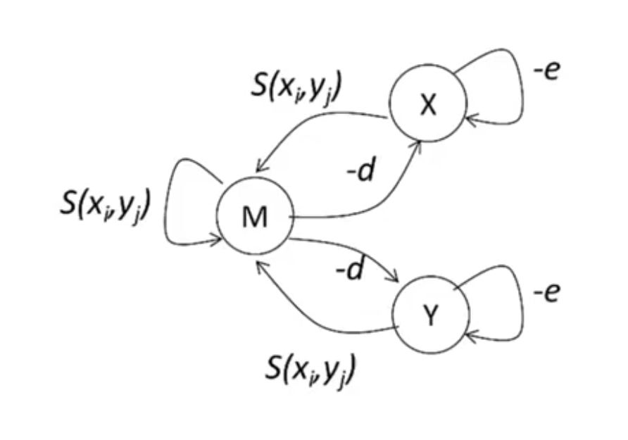

**转移说明：**
- **M → M**: 自环，得分 `s(xᵢ, yⱼ)`（继续匹配/错配）
- **M → X**: 得分 `-d`（开启空位，序列X插入）
- **M → Y**: 得分 `-d`（开启空位，序列Y插入）
- **X → X**: 自环，得分 `-e`（空位延伸）
- **X → M**: 得分 `s(xᵢ, yⱼ)`（从空位状态回到匹配）
- **Y → Y**: 自环，得分 `-e`（空位延伸）
- **Y → M**: 得分 `s(xᵢ, yⱼ)`（从空位状态回到匹配）


### 考虑仿射空位罚分的动态规划公式

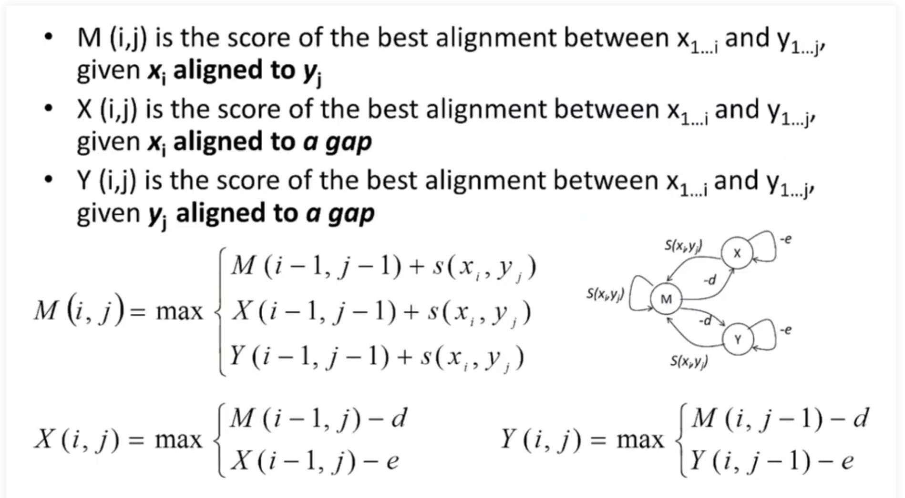 

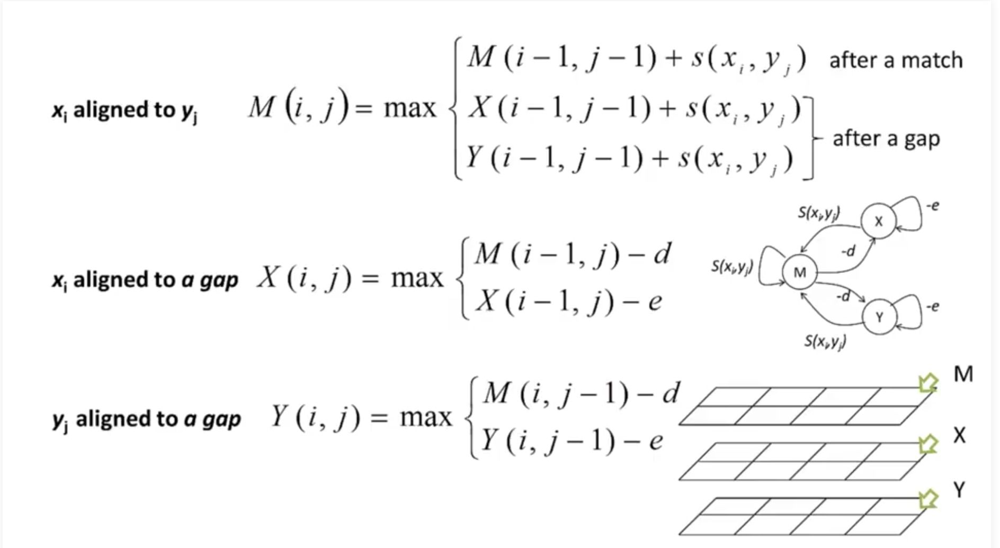

## 5 拓展

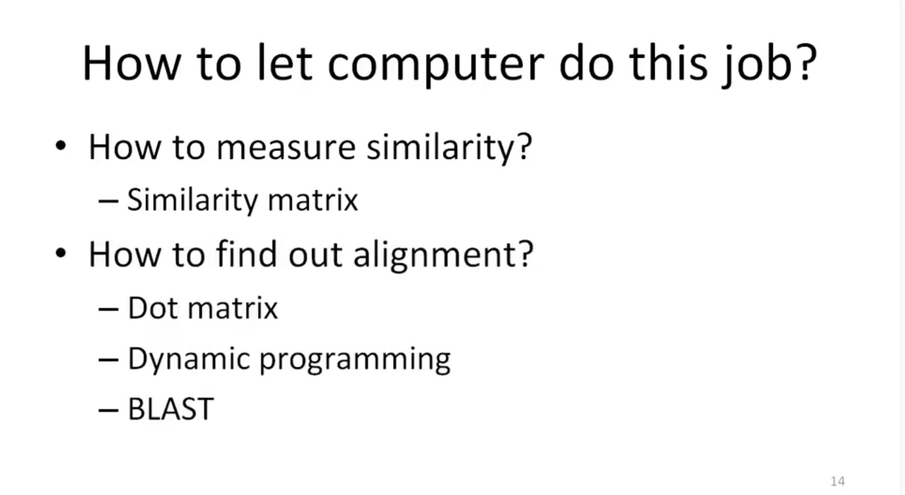 

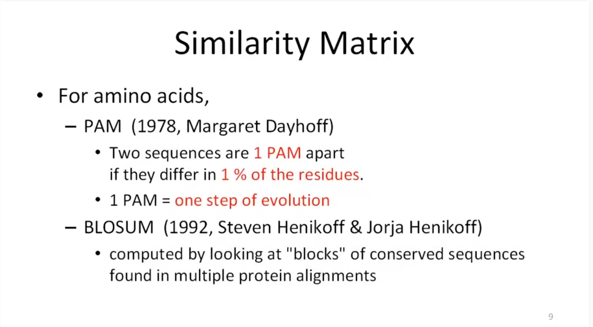 

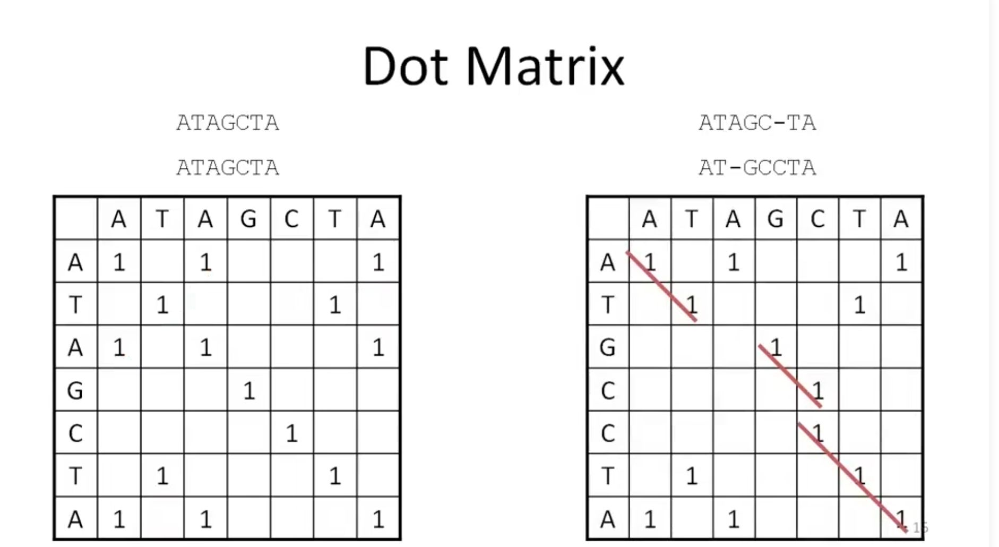 

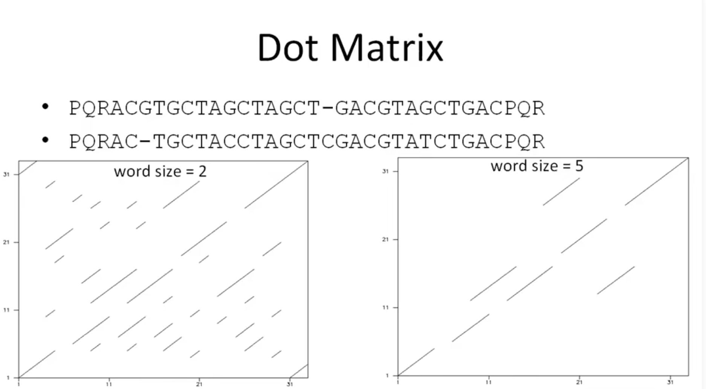


## 参考文献

1. [【视频】生物信息学  2-1序列比对中的基本概念](https://www.bilibili.com/video/BV13t411G7oh/?p=4)
2. [【视频】生物信息学  2-2 利用动态规划进行全局比对](https://www.bilibili.com/video/BV13t411G7oh/?p=5)
3. [【视频】生物信息学  2-3 从全局比对到局部比对](https://www.bilibili.com/video/BV13t411G7oh/?p=6)
4. [【视频】生物信息学  2-4 考虑仿射空位罚分的序列比对，以及如何计算Needleman-Wunsch算法的时间复杂度](https://www.bilibili.com/video/BV13t411G7oh/?p=7)


