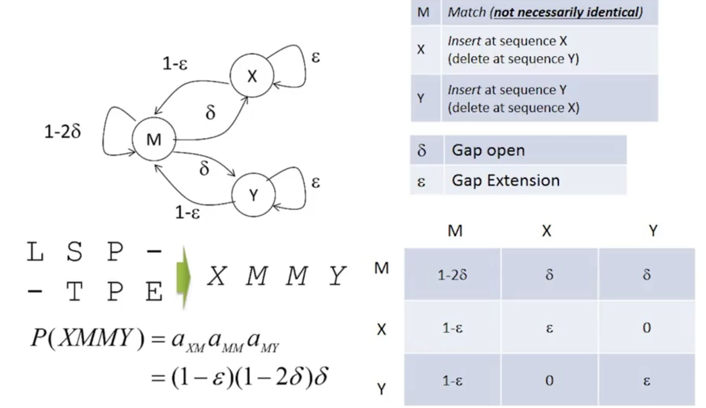
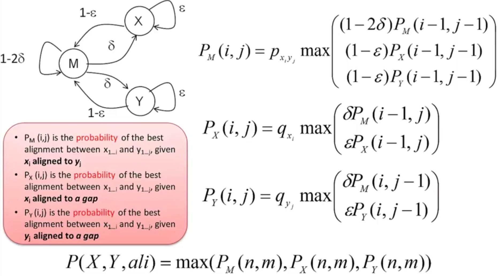

本章主要介绍马尔科夫链、隐马尔科夫模型等内容。


<!--more-->


## 1 从状态到马尔科夫链

**Markov Chain** （1906）

- A Markov chain describes a **discrete stochastic process at successive times**. The transitions from one state to all other states, including itself, are governed by **a probability distribution**

- 马尔可夫链描述的是连续时刻上的离散随机过程。从一个状态到所有其他状态（包括其自身）的转移，都由一个概率分布所支配。



上图右下角即为状态转移的概率分布矩阵。

---

## 2 隐马尔科夫模型


- The **observable symbols** ("tokens", y(t)) are generated according to their **corresponding states** (x(t)).    
（**可观察符号**（"标记/token"，y(t)）根据其**对应的状态**（x(t)）生成。）


- In addition to State **Transition Probability**, each state of HMM has a probability distribution over the possible output tokens (**Emission Probability**).
（除了状态**转移概率**之外，HMM的每个状态对可能的输出标记都有一个概率分布（**输出概率**）。）

- Thus, a HMM is consist of **two strings of information**.
  （因此，HMM由**两条信息链**组成。）
  - The **state path**（状态路径）
  - The **token path** (emitted sequence).（标记路径/输出序列）

**结构示意图：**

```
State Path（状态路径）:   X₁  →  X₂  →  ...  →  Xₙ₋₁  →  Xₙ
                         ↓      ↓             ↓        ↓
Token Path（标记路径）:   Y₁     Y₂    ...     Yₙ₋₁     Yₙ
```

- **State Path（状态路径）**：隐藏的状态序列 X₁, X₂, ..., Xₙ
- **Token Path（标记路径）**：可观察的输出序列 Y₁, Y₂, ..., Yₙ
- 箭头表示状态之间的转移以及状态到标记的生成关系


---

### HMM 核心概念总结

| 概念 | 英文 | 含义 |
|------|------|------|
| 状态路径 | State Path | 隐藏的、不可直接观察的状态序列 X = (X₁, X₂, ..., Xₙ) |
| 标记路径 | Token Path | 可观察的输出序列 Y = (Y₁, Y₂, ..., Yₙ) |
| 转移概率 | Transition Probability | 从一个状态转移到另一个状态的概率 P(Xₜ₊₁ \| Xₜ) |
| 发射概率 | Emission Probability | 在某个状态下生成特定标记的概率 P(Yₜ \| Xₜ) |

---

> 核心思想
> - 状态与观测相分离
> - 状态与状态之间存在转移概率，转移概率分布
> - 每个状态都可以产生一组可以观测的符号，生成概率分布
> - 建模的目标是，通过一组符号反推状态路径


---

### 基于HMM的序列比对

**标题：** Sequence alignment with HMM

- Each "token" of the HMM is an aligned pair of two residues (**M state**), or of a residue and a gap (**X or Y state**).
  （HMM的每个"标记"是两个残基的对齐对（**M状态**），或一个残基与一个空位（**X或Y状态**）。）
  
  - Transition and emission probabilities define the probability of each aligned pair of sequences.
    （转移概率和发射概率定义了每对序列比对的对齐概率。）

- Based on the HMM, each alignment of two sequences can be assigned with a probability
  （基于HMM，两条序列的每种比对都可以被赋予一个概率）
  
  - Given two input sequences, we look for an alignment with the **maximum probability**.
    （给定两条输入序列，我们寻找具有**最大概率**的比对。）

$$\arg\max_{ali}(P(S1, S2, ali))$$

---

### 核心概念对应

| HMM状态 | 含义 | 对应动态规划 |
|---------|------|-------------|
| **M state** | 两个残基对齐（Match/匹配） | F(i-1, j-1) + s(xᵢ, yⱼ) |
| **X state** | 序列X残基对空位（Insert at X / Delete at Y） | F(i-1, j) + d |
| **Y state** | 序列Y残基对空位（Insert at Y / Delete at X） | F(i, j-1) + d |

---

### 与动态规划的对比

| 方法 | 目标 |
|------|------|
| **动态规划** | 寻找**最大得分**（score-based） |
| **HMM** | 寻找**最大概率**（probability-based） |

HMM将序列比对问题转化为概率模型，通过转移概率（对应空位罚分）和发射概率（对应替换得分）来定义比对的最优性。



> 概率的引入可以让我们使用概率论的知识做更多分析。如，在不引入比对的情况下，来计算两条序列的最大可能相似性。

> 同一个观察序列可以来自许多不同的状态路径。
>
> 因此，将所有状态路径概率求和，就得到了该观察序列的全概率

$$
P(X,Y) = \sum_{ali} P(X,Y,ali)
$$

## 3 利用隐马尔科夫模型建立预测模型

**The Most Simple Gene Predictor (MSGP)**

Given a stretch of genomic sequence, where are the coding regions and where are noncoding regions?

`ACCCTAACCCTAACCCTCGCGGTACCCTCAGCCCGAAAAAAATCG`

---

**Training the model**

- What we need to train?
  - Transition Probabilities **between states**
  - Emission Probabilities **for each state**

- Estimate Probabilities from known "**Training set**"
  - An annotated genomic region, with coding/noncoding sequences labeled.

```
Token: ACGCTTCTGGTCCCCACAGACTCAGAGAGAACCCACCATGGTGATGT......
State: CCCCCCCCCNNNNNCCCCCCCCCNNNNNNNNNCCCCCCCCCCCCNNN......
```
  
$$\hat{a}_{kl} = \frac{a_{kl}}{\sum_{l'} a_{kl'}}$$

$$\hat{e}_k(b) = \frac{e_k(b)}{\sum_{b'} e_k(b')}$$


> 通常情况下，概率的连续相乘，不仅慢，且因计算机机制，数值过小会出现下溢的风险，所以通常引入对数计算，将乘法转化为加法，提前将概率矩阵取对数。
---
**How to build a model**
如何构建一个模型

- **Three fundamental problems: given model M=M(w)**
  
  三个基本问题：给定模型 M=M(w)

- **Evaluation:** one sequence 'O = O1O2...' : calculate P(O|w)
  
  评估：给定一条序列 'O = O1O2...'：计算 P(O|w)

- **Decoding:** multiple sequences 'Oa/Ob...': choose S = q1q2... which could best interpret observed sequences O
  
  解码：多条序列 'Oa/Ob...'：选择 S = q1q2... 以最好地解释观测序列 O

- **Learning:** Adjust parameters to maximize P(O|w), use observed sequences to train the model
  
  学习：调整参数以最大化 P(O|w)，利用观测序列来训练模型
