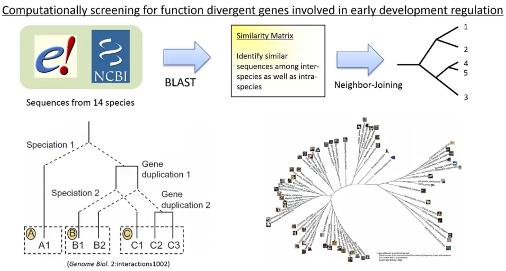
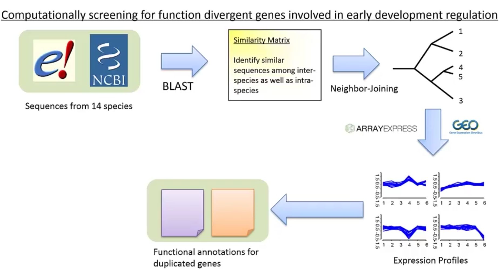
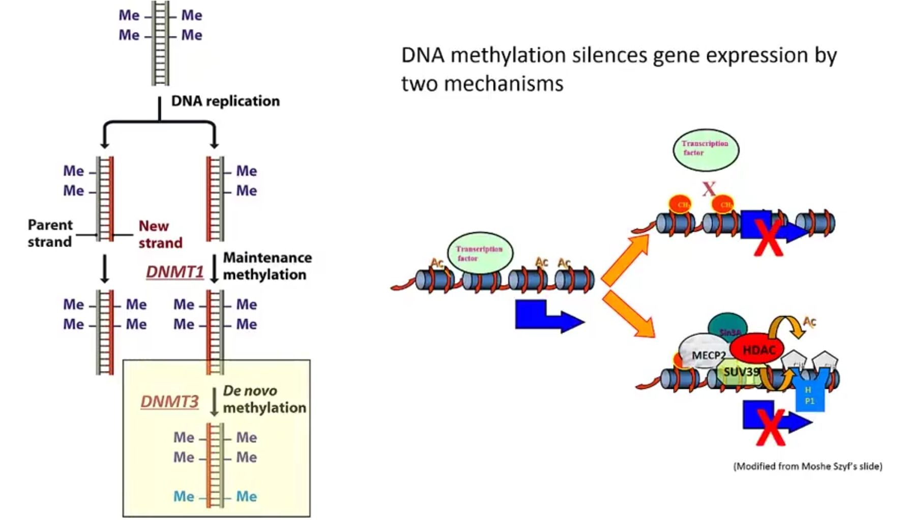
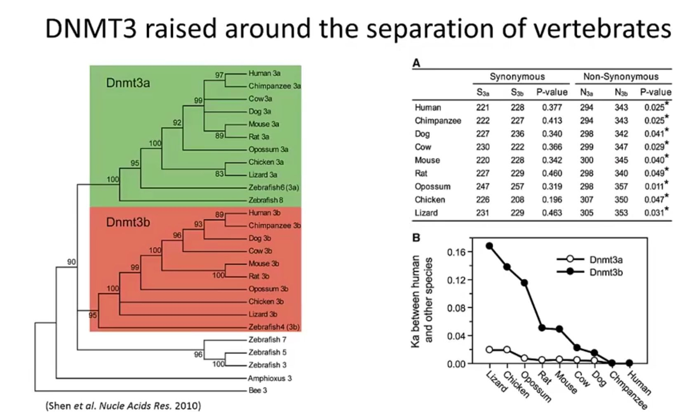
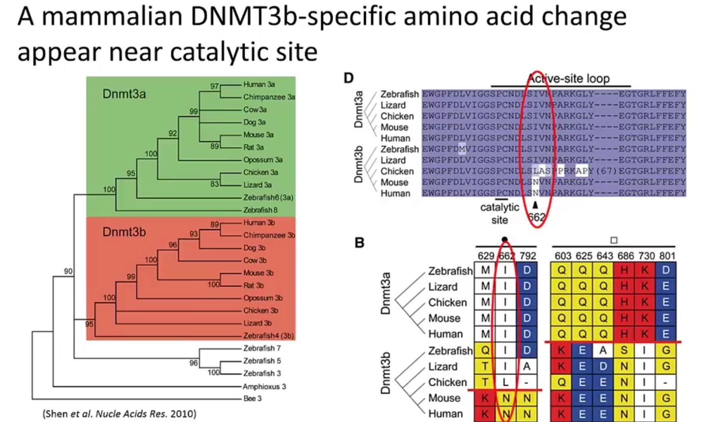
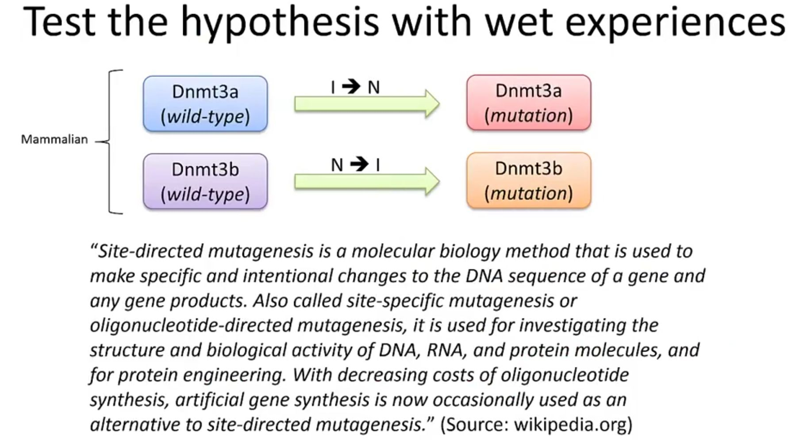
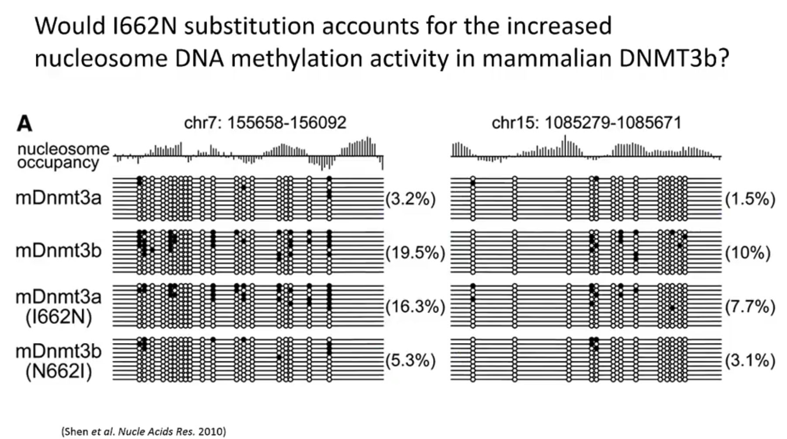
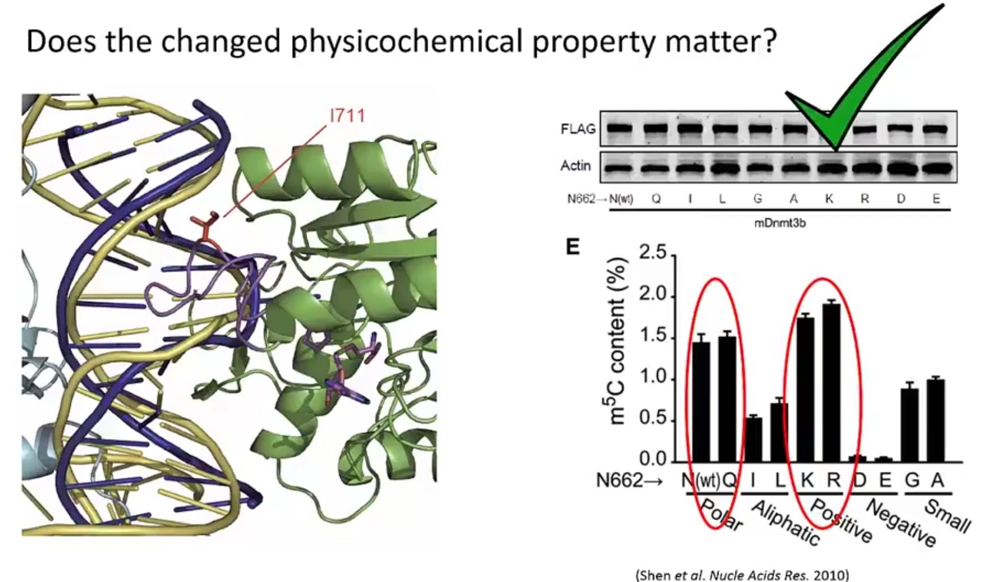
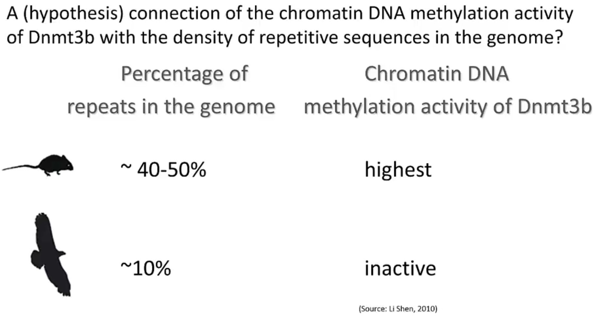
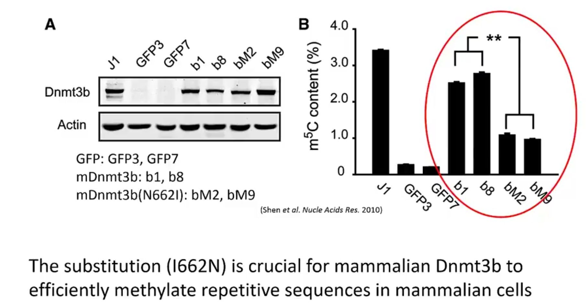

本章主要介绍综合运用生物信息学方法与实验技术解决生物学问题等内容。

<!--more-->

## 研究过程

同源基因根据来源进一步划分为
- 直系同源基因，物种分化事件产生
- 旁系同源基因，基因复制的产物

通常不同物质之间的直系同源基因功能类似。 \
——这是我们可以用模式生物来研究人类生物学问题的基础。

由基因复制事件产生的旁系同源基因往往具有不同的功能。 \
——复制基因之间随着时间的演进会发生序列变异，进而产生功能上的分化进而产生新的基因。

从形态学上看，生物的早期发育是非常保守的。

Q: 在生物早期发育阶段，是否存在基因复制形成的新基因？如果有，这些新基因如何发挥功能？

下面使用生物信息学的技术来回答此问题

 

1. 比较多个物种，找到复制基因
2. 使用临接法来对每组相似的基因cluster构造基因树
3. 通过将基因树与物种树进行比较来区分直系同源基因、旁系同源基因

1. 进一步，利用表达树筛选参与早期发育相关的复制基因
2. 根据功能注释，筛选功能分化的复制基因

> ### 分析流程
> **Computationally screening for function diverged genes involved in early development regulation** \
> 通过计算筛选参与早期发育调控的功能分化基因
>
> **Computational Genomic Analysis and Bioinformatics through *MAPK*:**
> 通过 *MAPK* 进行的计算基因组分析与生物信息学：
>
> **1. Sequence databases constructed directly from the Ensembl website;** \
> 直接从 Ensembl 网站构建序列数据库；
>
> **2. Each peptide sequence in the database used to search the database using BLAST package.** \
> 使用 BLAST 软件包对数据库中的每个肽序列进行数据库搜索。
>
> **3. Phylogenetic trees were constructed and paralogous pairs are identified from the resulting alignments based on a minimal amino acid identity (e.g. 50% and 70%) and an overlap of ≥ 35 amino acids in the region of local alignment.** \
> 构建系统发育树，并根据最小氨基酸同一性（如 50% 和 70%）以及局部比对区域中 ≥ 35 个氨基酸的重叠，从比对结果中鉴定旁系同源基因对。
> 
> **4. Coding regions of pairs that meet these criteria will be aligned with the corresponding region and inspected for putative function divergence hallmarks.** \
> 满足这些标准的基因对的编码区将与相应区域进行比对，并检查推定的功能分化标志。
> 
> **5. Local warehouse were searched for further indicators derived from high-throughput data (esp. genetic, genomic, transcriptomic, proteomic and pathway data).** \
> 在本地数据库中搜索来自高通量数据的进一步指标（特别是遗传、基因组、转录组、蛋白质组和通路数据）。
>
> **实验结果：7 out of 50000+ new paralogous pairs showed clear functional divergence features involved in early development regulation.** \
> 在 50000 多个新的旁系同源基因对中，有 7 对表现出与早期发育调控相关的明显功能分化特征。

筛选DNA甲基化酶(DNMT3)作为后续分析对象

脊椎动物出现时发生的一次基因复制事件，形成了Dnmt3a和Dnmt3b两个版本，其在哺乳动物出现后序列出现了急剧的分化。

在哺乳动物的研究表明，Dnmt3a和Dnmt3b的功能有显著区别
- 在Dnmt3b敲除的小鼠中，会发生全基因组范围的甲基化水平下降，并进而导致胚胎死亡
- 在Dnmt3a敲除的小鼠中，没有观察到上述现象

通过序列比对，在催化中心附近存在着一个哺乳动物Dnmt3b特异的氨基酸突变。**这个位点在所有的Dnmt3a以及非哺乳动物的Dnmt3b中均是异亮氨酸，而在哺乳动物的Dnmt3b中则变成了天冬酰胺。**
这两个氨基酸在理化性质上存在的显著差异，特别是，两者在极性、疏水性和电性上都有明显的不同。

结构分析显示，“异亮氨酸->天冬酰胺”可以显著增强酶与带负电的DNA分子的结合强度。

基于此可以**猜测**，哺乳动物中，这个I->N替代导致的理化性质的改变可以增强甲基化酶与基因组DNA的结合强度，并进而使其获得相对于Dnmt3a以及非哺乳动物Dnmt3b更强的甲基化活性。

验证实验：

最直接思路：构造两个独立的突变体进行实验，但在哺乳动物中进行实验，难以排除内源性甲基化酶（endogenous DNMTs）带来的影响。
最终选用**酵母**来进行实验，可以排除该影响。

- 哺乳动物的Dnmt3b对比哺乳动物的Dnmt3a、非哺乳动物的Dnmt3b，对于chromatin DNA有更强的甲基化活性

这种差异是否与之前观察到的“异亮氨酸->天冬酰胺”的替代有关？为做检验，进一步实验

这种改变是否是由两者在理化性质上的巨大差异导致的？

Q: 功能上的变化对于演化有什么好处？ \
假设：哺乳动物Dnmt3b中的变化有助于其抑制转座子等重复元件
> 提出的假说：Dnmt3b 的染色质甲基化功能可能与基因组中重复序列的丰度相关。在重复序列丰富的基因组中，Dnmt3b可能被大量激活，以甲基化沉默这些重复元件，从而维持基因组稳定性（防止转座子跳跃和异位重组）。

验证实验：

## 总结

- Evolution-guided bioinformatics analysis successfully identified interesting genes involved in early development regulation showed clear functional novelty during evolution, and also provided strong hints for the key substitution, its biochemical effort, and the eventually functional significance. \
以进化为导向的生物信息学分析成功鉴定了参与早期发育调控的有趣基因，这些基因在进化过程中表现出明确的功能新颖性；该分析还为关键氨基酸替换、其生化作用机制以及最终的功能意义提供了强有力的线索。

- Key single substitution could result in significant functional novelty and help novel gene (re-)wired itself into existing circuits. \
关键的单氨基酸替换可以导致显著的功能新颖性，并帮助新基因（重新）连接整合到已有的生物学通路/调控网络中。

- An integrated, genome-scale bioinformatic analysis combined with targeted experimental assay is effective in studying complex biological system. \
整合性的全基因组规模生物信息学分析，结合针对性的实验验证，是研究复杂生物系统的有效方法。

## 参考文献

1. [【视频】生物信息学  12-1 从干实验到湿实验——一个演化问题 第1部分](https://www.bilibili.com/video/BV13t411G7oh/?p=68)
2. [【视频】生物信息学  12-3 从干实验到湿实验——一个演化问题 第2部分](https://www.bilibili.com/video/BV13t411G7oh/?p=70)
