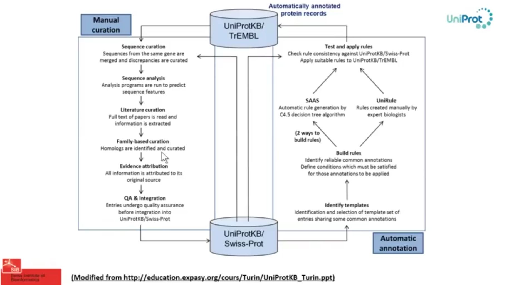
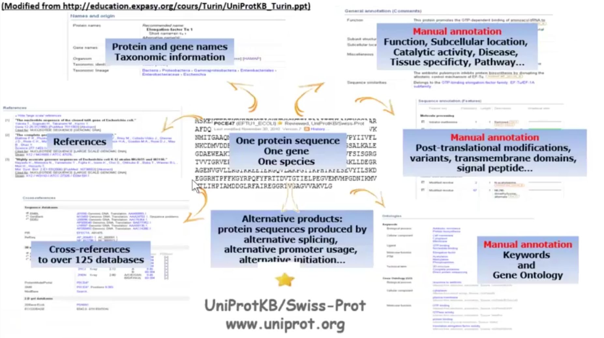
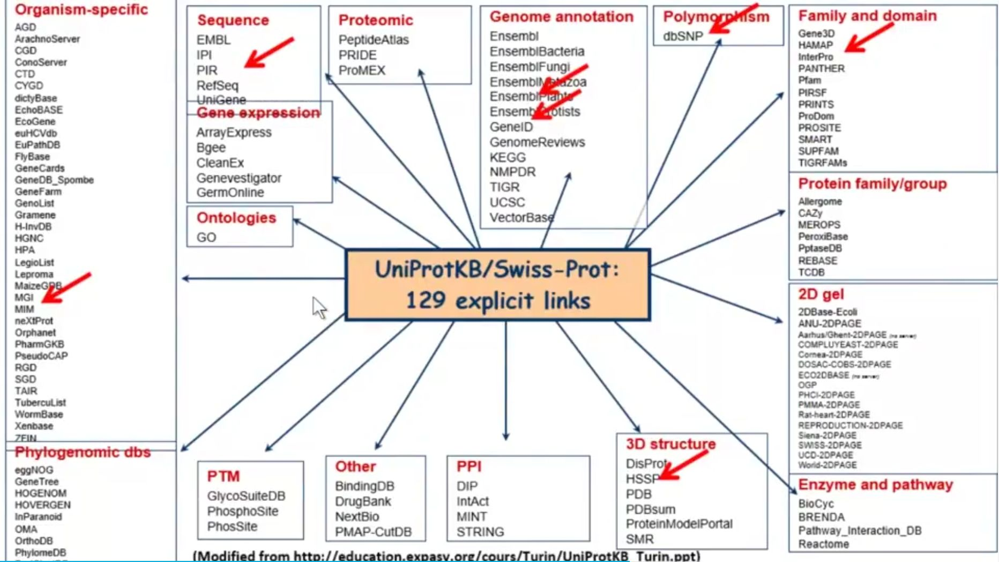
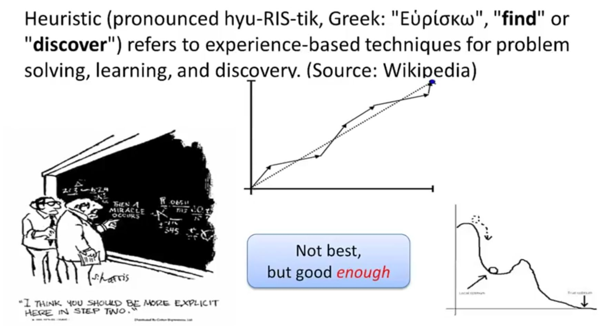

本章主要介绍序列数据库、BLAST算法等内容。


<!--more-->

## 1 序列数据库


- Rather than do the alignment pair-wise, it's more often to search **sequence database** in a **high-throughput** style.
  （与其逐对进行比对，更常见的是以**高通量**方式搜索**序列数据库**。）

- Or, identify similarities between
  - **novel query sequence**
    whose structures and functions are usually unknown and/or uncharacterized
    （**新的查询序列** — 其结构和功能通常未知和/或未表征）
  - **sequences in (public) databases**
    whose structures and functions have been elucidated and annotated.
    （**（公共）数据库中的序列** — 其结构和功能已被阐明和注释）


- The **query sequence** is compared/aligned with every sequence in the database
  （**查询序列**与数据库中的每条序列进行比较/比对）

- **Statistically significant hits** are assumed to be related to the query sequence
  （**统计显著的命中**被认为与查询序列相关）
  - Similar **function/structure**
  - Common **evolutionary ancestor**

---

### 朴素的数据库搜索算法 
A (naive) algorithm for database searching


**流程图：**

```
┌─────────────────────────┐
│  Get the inputted query │  <─ 获取输入的查询序列
└───────────┬─────────────┘
            ↓
┌─────────────────────────┐
│   Get a database seq    │   获取一条数据库序列
│                         │  <────┐
└───────────┬─────────────┘       │
            ↓                     │
┌─────────────────────────┐       │
│ Run pair-wise global/   │       │
│ local alignment between │       │
│ query and database seq  │       │
└───────────┬─────────────┘       │
            └─────────────────────┘
              （循环：对数据库中每条序列重复此过程）
```

---

### 动态规划矩阵算法复杂度分析


- **Sequence X of length m**（长度为 m 的序列X）— 横向
- **Sequence Y of length n**（长度为 n 的序列Y）— 纵向

- There are **n*m** entries in the matrix.
  （矩阵中有 n*m 个单元格）

- Each entry requires a **constant number c** of operation(s).
  （每个单元格需要常数 c 次操作）

 **c * m * n** operations needed in total, for one pair-wise alignment.（一次成对比对总共需要 **c * m * n** 次操作）

---

### 实际计算时间估算

- Say your query sequence (HBA_HUMAN) has **142 amino-acids**
  （假设查询序列 HBA_HUMAN 有 142 个氨基酸）

- Most recent release of human-curated **Swiss-Prot** protein databases contains **540,958 sequences** with **192,206,270 amino acids** (Sept 18th, 2013);
  （最新版人工审校的 Swiss-Prot 蛋白质数据库包含 540,958 条序列，共 192,206,270 个氨基酸，2013年9月18日数据）
  - On average, the sequence length is 192,206,270 / 540,958 = **355.30 aa**
    （平均序列长度为 355.30 个氨基酸）

- And assume your super-fast computer can run one operation in **1μs** = (0.000001s)
  （假设超级计算机每微秒执行一次操作）

- Then, you will need **7.8 hr** for **ONE** comparison!
  （那么，**一次**比对就需要 **7.8 小时**！）

---

### UniProt数据库简介

The mission of **UniProt** is to provide the scientific community with a comprehensive, **high-quality** and **freely accessible** resource of protein sequence and functional information.
（UniProt 的使命是为科学界提供全面、**高质量**且**免费开放**的蛋白质序列和功能信息资源。）

```
        data                          knowledge
   protein sequence  <──────>  functional information
```

 
 


---


## 2 BLAST算法(Basic Local Alignment Search Tool)

参考视频
(https://www.bilibili.com/video/BV13t411G7oh/?p=11）

### BLAST简介

- To make the alignment effectively, a **Heuristic algorithm** **BLAST** (**B**asic **L**ocal **A**lignment **S**earch **T**ool) is proposed by **Altschul** *et al* in **1990**.
  （为了提高比对效率，Altschul 等人于1990年提出了启发式算法 BLAST）

- BLAST finds the highest scoring **locally optimal alignments** between a query sequence and a database.
  （BLAST 寻找查询序列与数据库之间得分最高的**局部最优比对**）
  - Very **fast** algorithm（非常快）
  - Can be used to search **extremely large** databases（可搜索极大数据库）
  - Sufficiently **sensitive** and **selective** for most purposes（对大多数用途足够敏感和特异）
  - **Robust** — the default parameters just work for most cases（鲁棒性强 — 默认参数适用于大多数情况）

---

### BLAST核心思想

BLAST Ideas: Seeding-and-extending

1. Find matches (**seed**) between the query and subject
   （在查询序列和靶序列之间寻找匹配（**种子**））

2. Extend seed into High Scoring Segment Pairs (**HSPs**)
   （将种子延伸为高得分片段对（**HSPs**））
   - Run Smith-Waterman algorithm on the specified region only.
     （仅在指定区域运行 Smith-Waterman 算法）

3. Assess the reliability of the alignment.
   （评估比对的可靠性）

---

### BLAST工作流程

```
Query Sequence
(amino acid or nucleotide) 
           |
 *Filtering| 
           ↓
Query Sequence Marked
           |
   *Seeding| 
           ↓      #Scoring matrix    
      Word Hits  <─────────────  Database
     （词查询命中）
           |
 *Extension| #Scoring matrix
           ↓ 
      Raw Scores
High-Scoring Segment pairs (HSP)
   （原始得分 / 高得分片段对）
           |
*Evaluation|
           ↓
E-value Sequence Alignment
    （E值 / 序列比对）

```

**流程总结：**

| 步骤 | 操作 |
|------|------|
| **Filtering** | 对查询序列进行过滤（标记低复杂度区域） |
| **Seeding** | 在数据库中寻找匹配的种子（使用打分矩阵） |
| **Extension** | 将种子向两端延伸（使用打分矩阵） |
| **Evaluation** | 评估HSP，计算E值，输出序列比对 |


---

### Filtering 加速策略——屏蔽低复杂度区域

- Low complexity sequences yield false positives.
  （低复杂度序列会产生假阳性）

  - CACACACACACACACA
  - KLKLKLKLKLKL

**复杂度计算公式（K值）：**

$$K = \frac{1}{L} \log_N \left( \frac{L!}{\prod_i n_i!} \right)$$

| 符号 | 含义 |
|------|------|
| **L** | Window length — 窗口长度 |
| **N** | Alphabet size (4 or 20) — 字母表大小（4或20） |
| **nᵢ** | Frequency of the ith letter — 第i个字母的频率 |

---

### 示例：随机匹配的概率分析

For a given amino acid, we have the chance of **1/20** to have a random match (as there are just 20 different amino acids in total).
（对于给定氨基酸，随机匹配的概率为 **1/20**，因为总共只有20种不同氨基酸。）

Thus, for an amino acid sequence with length L, the probability of having a random match across the full length is **(1/20)^L**
（因此，长度为L的氨基酸序列，全长度随机匹配的概率为 **(1/20)^L**）

Say you have a **6 AA peptide** (not so unusual, e.g. the Tryptophyllin-T2-6 in *Phyllomedusa azurea* or "Orange-legged monkey frog, 橙腿猴树蛙" is a 6 AA peptide), then the odd would be **(1/20)^6 = 1.56 × 10^-8**
（假设有一个6氨基酸肽（并不罕见，例如橙腿猴树蛙中的Tryptophyllin-T2-6就是6氨基酸肽），则概率为 **(1/20)^6 = 1.56 × 10^-8**）

Looks not so big, huh?
（看起来不太大，对吧？）

But you're searching **Swiss-Prot databases** which contains **192,206,270 amino acids** in **540,958 sequences** (Sept 18th, 2013). Then you would expect to have **(1/20)^6 × 192,206,270 = 3.00 matches by chance**, for any 6 AA peptide!
（但你在搜索 Swiss-Prot 数据库，其中包含540,958条序列共192,206,270个氨基酸（2013年9月18日数据）。那么对于任何6氨基酸肽，你预期会**随机找到3.00个匹配**！）


---

### E值——评估随机匹配的可能性

E-Value: How a match is likely to arise **by chance**

- **The expected number** of alignments with a given score that would be expected to occur **at random** in the database that has been searched
  （E值是在已搜索的数据库中，预期**随机出现**的、具有给定得分的比对**期望数量**）

  - e.g. if **E=10**, 10 matches with scores this high are expected to be found **by chance**
    （例如，若 **E=10**，则预期有10个如此高得分的匹配是**随机出现**的）

**E值计算公式：**

$$
E = kmne^{-\lambda S}
$$

- **m**: 查询序列的长度
- **n**: 数据库的大小
- **S**: 比对分数
- **k**和**λ**: 与打分系统、搜索空间相关的修正因子

---

### BLAST 的关键启发式策略

- **Key heuristics in BLAST**
  - Seeding-and-extending: looking for seeds of high scoring alignments **ONLY**
    （种子与延伸：仅寻找高得分比对的种子）
    - **Use dynamic programming selectively**
      （有选择地使用动态规划）

- **Tradeoff: speed vs. sensitivity**
  （权衡：速度 vs 灵敏度）
  - Empirically, **1000 ~ 10000 times faster** than plain Dynamic-Programming-based local alignment
    （经验上，比基于纯动态规划的局部比对快 **1000~10000倍**）
  - But suffer from **low sensitivity**, especially for distant sequences (e.g. *E.coli* → human)
    （但**灵敏度较低**，尤其对远缘序列（如大肠杆菌→人类））

---
### BLAST的局限性

- BLAST使用的是启发式算法，找到的不是最优解




## 参考文献

1. [【视频】生物信息学  3-1 序列数据库](https://www.bilibili.com/video/BV13t411G7oh/?p=9)
2. [【视频】生物信息学  3-2 BLAST算法初探](https://www.bilibili.com/video/BV13t411G7oh/?p=10)
