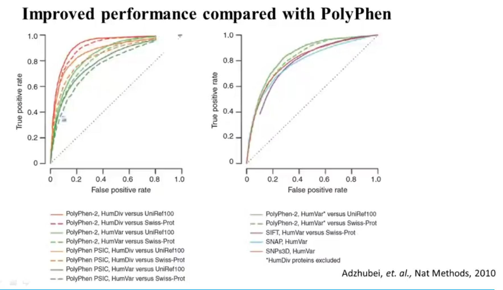

本章主要介绍遗传变异对功能和表型的影响、遗传变异数据库、基于保守性和规则的预测方法、基于机器学习分类器的预测方法等内容。

<!--more-->

## 1 问题概述

遗传变异的三个途径
- 父母遗传
- 每个人都有70~100个de novo mutations(新发突变)
- 体细胞突变 (如，癌症)

人类基因变异的几种类型
- Chromosomal aneuploidy 染色体非整倍体（染色体数目异常），如唐氏综合征
- Structural Variations (SVs) 结构变异
- Copy Number Variations (CNVs) 拷贝数变异
- Short insertion/deletion (indels) 短插入/缺失
- Single Nucleotide Variations (SNVs) 单核苷酸变异

术语差别
- **mutation**: 小于1%的变异，突变
- **polymorphism**: 超过1%的变异，多态（有时候这个cut off是5%）
- **variation、variant**： 以上两种的统称 

每个人基因组大概都有3百万个单核苷酸变异，大概占0.1%

主要研究两个问题
- 致病突变与正常基因相比有什么特点
- 如何预测一个突变是否致病

## 2 遗传变异数据库

**dbSNP**：存储所有鉴定出来的遗传变异，目前大约有12亿条人类基因的SNP(rs)参考记录
- <https://ncbiinsights.ncbi.nlm.nih.gov/2025/03/18/dbsnp-release-157/>

**1000 Genomes**：千人基因组数据库，截止2012年有1092个
- <https://www.internationalgenome.org/>

**OMIM**：有1.2W与单基因遗传病相关信息
- <https://www.omim.org/>

**HGMD (Human Gene Mutation Database)**： 截止2013年有5.7k条基因上超过141k个不同变异，有公共版、专业版，专业版收费
- <https://www.hgmd.cf.ac.uk/ac/index.php>

**LSDBs (Locus specific databases)**：收集了所有基因相关致病变异
- <http://www.lovd.nl/3.0/home>

## 3 预测方法

基于保守性：SIFT (Sort Intolerant From Tolerant substitutions) (2006)
- <http://sift.jcvi.org>
- 1.搜索相似序列
- 2.挑选相似性比较高的序列进行比对，要求90%以上的一致性
- 3.多序列比对
- 4.计算所有比对点位可能存在替换的归一化概率

基于规则的PolyPhen (2001) VS 基于机器学习分类器的PolyPhen2 (2010)

**PDB**获取蛋白质3D结构: <http://www.rcsb.org/pdb/home/home.do> 

未知蛋白的结构预测
1. 找到同源蛋白结构，借鉴已知相同位点的backbone
2. 使用能量方程，将比对不上的位点和改变了的氨基酸，计算定位

（TODO： AlphaFold使用该方式？？？）

基于机器学习分类器的预测方法：SAPRED
<https://www.bilibili.com/video/BV13t411G7oh?p=29>

## 参考文献

1. [【视频】生物信息学  6-1问题概述](https://www.bilibili.com/video/BV13t411G7oh/?p=26)
2. [【视频】生物信息学  6-2记录变异的数据库](https://www.bilibili.com/video/BV13t411G7oh/?p=27)
3. [【视频】生物信息学  6-3 基于保守性和规则的预测方法：SIFT和PolyPhen](https://www.bilibili.com/video/BV13t411G7oh/?p=28)
4. [【视频】生物信息学  6-4 基于机器学习分类器的预测方法：SAPRED](https://www.bilibili.com/video/BV13t411G7oh/?p=29)
