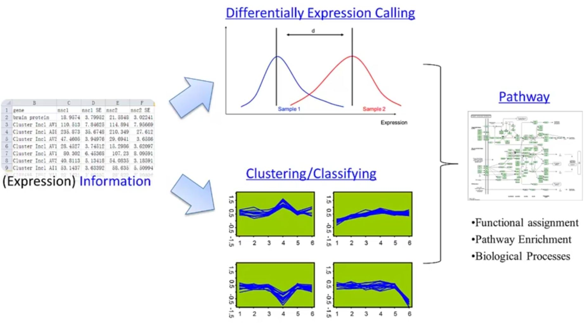
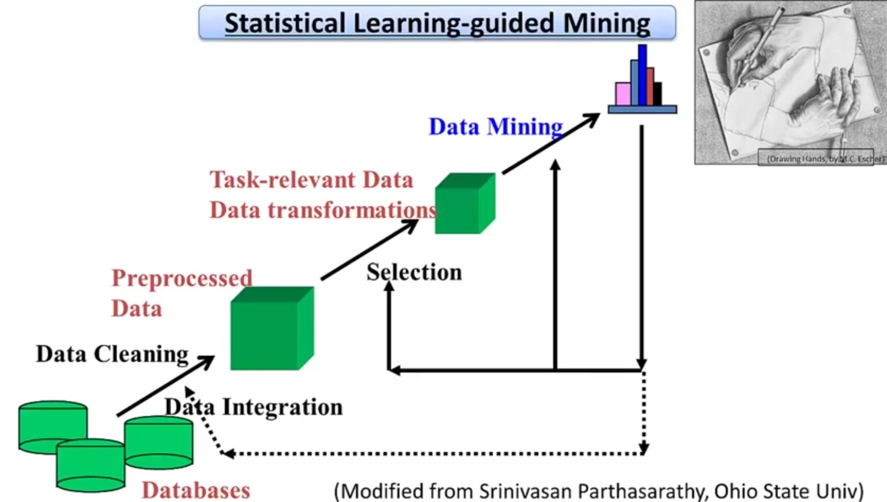

本章主要介绍转录组、RNA测序数据回贴与组装、RNA-seq 数据分析、转录组数据挖掘、差异表达与聚类分析等内容。

<!--more-->

深度测序技术(NGS, next generation sequencing) 即第二代测序技术

## 1 转录组介绍

转录组
- mRNA (message RNA)
- miRNA (micro RNA)
- lncRNA (long non-coding RNA)

研究内容
- 定性：鉴定出所有表达的转录
- 定量：确定这些转录各自的表达量

研究技术
- Real-Time qRT-PCR
    - 基于互补杂交反应，广泛公认为“金标准”
    - 缺点：吞吐量低；需要事先知道转录本序列，难以用来发现未知的转录
- Microarray（微阵列、基因芯片）
    - 用于基于互补杂交反应的基因表达分析
    - 标记靶标：来自生物样本的RNA
    - 探针：大量有序的固定核苷酸分子，具有已知序列
    - 缺点：需要事先知道转录本序列
- Expressed Sequence Tag (EST)
    - 随机对cDNA文库中的单个克隆体进行测序
        - 短“标签”：60~500bp
        - 一次性测序：易出错（~1%）
    - 优点：无需预先知道转录本序列（不仅能测量，还能发现新转录）
    - 通量限制，只能得到几千个转录序列（1991）
- RNA-Seq
    - Sample RNA --(逆转录+PCR)-->Amplified cDNA--(打碎)-->cDNA fragments--(测序仪)-->reads
    - 可以同时对转录组定性定量研究
    - 本质上是对转录本序列的随机采样，因此检测效果和灵敏度高度依赖于检测的深度
    - \# of mapped reads ∝ 表达量
    - \# of mapped reads ∝ 转录长度
    - \# of mapped reads ∝ 测序深度

通常将原始reads数目进行归一化处理，其中一种方法：RPKM（the \# of mapped **R**eads **p**er **K**B per **m**illion reads.）

$$
RPKM=10^9 \frac{C}{NL}
$$

- C: the \# of mapped reads for specified transcript.
- N: the \# of total mapped reads.
- L: the length of the specified transcript.

--- 
### PCR

**PCR** 是 **Polymerase Chain Reaction** 的缩写，中文译为 **聚合酶链式反应**。
一种在体外快速扩增特定 DNA 片段的分子生物学技术。通过温度循环，利用 DNA 聚合酶将微量的目标 DNA 指数级扩增到可检测的量。

#### 基本原理（三步循环）

| 步骤 | 温度 | 作用 |
|------|------|------|
| **变性（Denaturation）** | ~94–98°C | 双链 DNA 解开为单链 |
| **退火（Annealing）** | ~50–65°C | 引物与单链 DNA 的互补序列结合 |
| **延伸（Extension）** | ~72°C | DNA 聚合酶沿模板合成新链 |

每完成一轮循环，DNA 量理论上翻倍，经过 **25–35 个循环**后可扩增数百万倍。

#### 关键组分
- **模板 DNA**：含目标序列的 DNA 样本
- **引物（Primers）**：与目标序列两端互补的短单链 DNA，决定扩增特异性
- **DNA 聚合酶**：常用 *Taq* 酶（耐高温）
- **dNTPs**：四种脱氧核苷酸（A、T、C、G）
- **缓冲液**：提供适宜的 pH 和离子环境（如 Mg²⁺）

#### 主要应用
- **基因克隆**：获取大量目的 DNA 片段
- **基因检测**：诊断遗传病、病原体感染（如新冠核酸检测）
- **法医鉴定**：DNA 指纹分析
- **突变分析**：检测基因突变或多态性
- **测序准备**：为测序反应提供足够模板

#### 常见衍生技术
- **RT-PCR**：以 RNA 为模板，先逆转录为 cDNA，再进行 PCR
- **qPCR / RT-qPCR**：实时定量 PCR，可定量检测 DNA/RNA 的初始拷贝数
- **巢式 PCR、 touchdown PCR**：提高特异性或灵敏度的改良方法

## 2 RNA测序数据回贴与组装

### 2.1 mapping

- Input Data
    - Reference Genome
        - Nucleotide
        - Length: Hundreds of Mb per chromosome
        - ~3 Gb in total (for human genome)
    - Reads
        - Nucleotide, with **various qualities** (relatively high error rate: 1e-2 ~ 1e-5)
        - Length: 36~80 bp per read
        - hundreds of Gbs per run

**junction reads**: 跨过剪切位点的reads
- 产生原因：RNA剪接。在真核生物中，基因转录产生的前体mRNA（pre-mRNA）包含外显子（exons）和内含子（introns）。经过剪接后，内含子被切除，外显子被连接形成成熟mRNA。当对成熟mRNA进行测序（RNA-seq）时，测序得到的reads就会跨越原本在基因组上被内含子隔开的两个外显子边界，从而形成junction reads。

只有将junction reads从剪切位点断开，才能贴回基因组上

处理策略：
1. "Join exon"，根据已知的外显子集合构建所有可能的junction组合，与junction reads逐个比对
    - 快
    - 能识别新的剪接变体
    - 无法应对未知的外显子和未知的基因
2. "Split reads"，切分reads，在更小粒度上寻找junction site
    - 比"Join exon"慢
    - 能识别新的剪接变体
    - 能发现新的外显子、基因

### 2.2 assembly 

思路：将转录的组装问题描述为对一个有向图的遍历问题
- Cufflinks工具（Trapnell C. et al. Nature Biotechnology 2010）

## 3 RNA-seq 数据分析

相关工具：（详细使用方法，参考后文8-3课程视频）
- TopHat
- Cufflinks
- Cuffmerge
- Cuffdiff
- CummeRbund (R程序包)

分析流程：（原始数据--->可视化）
1. 急速、通用short read比对工具（Bowtie）
2. 使用Bowtie将RNA-seq reads与基因组进行比对，发现剪接位点(TopHat)
3. 组装转录本(Cufflinks)
4. 比较转录本组装结果与参考注释文件（CuffCompare）
5. 合并两个或多个转录本组装结果（Cuffmerge）
6. 发现差异表达的基因和转录本，检测差异性剪接和启动子使用（Cuffdiff）
7. 绘制CuffDiff的丰度和差异表达结果（CummeRbund）

Tips：分析前搞清楚，如何分链的！使用不同的方法reads方向不同

## 4 转录组数据挖掘

(Sequencing) Data -->(Expression) Information --> (Biological) Knowledge

 

基于统计方法推断（基于部分样本推断总体性质），参考已有生物学知识反复进行迭代式改进，基于应用统计方法的数据挖掘

## 5 差异表达与聚类分析*

鉴定出ncRNA后，如何推断其作用机制及功能?
- microRNA等作用机制比较清楚的RNA，可以参考其作用机制，利用碱基互补等方式预测其靶标，进而推断生物学功能
- lncRNA等具体作用机制尚待明确的非编码RNA，可以根据在表达调控网络中表达相关的基因往往具有功能相关性这一特征，利用表达关联来推断其功能
    - 不同条件下，差异表达的基因
    - 不同条件下，共表达的基因

**聚类分析**可以帮助快速寻找共表达的基因，有助于推断基因功能、有效发现基因之间存在的调控关系。
- 核心：距离度量，衡量两个基因之间表达模式的相似程度
    - 欧式距离（绝对距离），关心表达量，即两个基因在**表达水平**之间的相似程度
    - Pearson距离（关联距离），关心表达模式，即两个基因在**表达变化**上的一致性

## 参考文献

1. [【视频】生物信息学  8-1 转录组介绍](https://www.bilibili.com/video/BV13t411G7oh/?p=35)
2. [【视频】生物信息学  8-2 RNA测序数据回贴与组装](https://www.bilibili.com/video/BV13t411G7oh/?p=36)
3. [【视频】生物信息学  8-3 RNA-seq 数据分析](https://www.bilibili.com/video/BV13t411G7oh/?p=37)
4. [【视频】生物信息学  8-4 转录组数据挖掘](https://www.bilibili.com/video/BV13t411G7oh/?p=38)
5. [【视频】生物信息学  8-5 差异表达与聚类分析](https://www.bilibili.com/video/BV13t411G7oh/?p=39)
